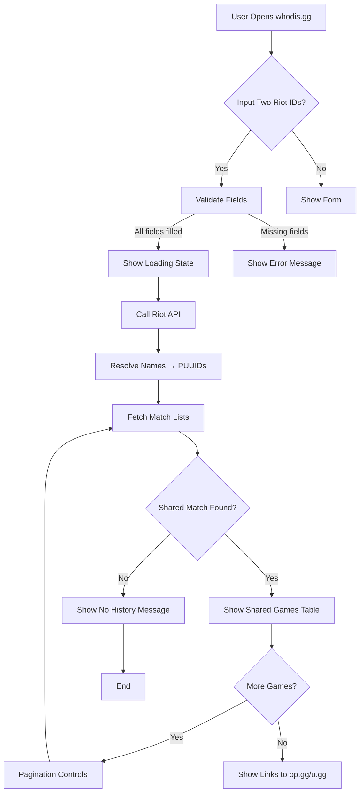
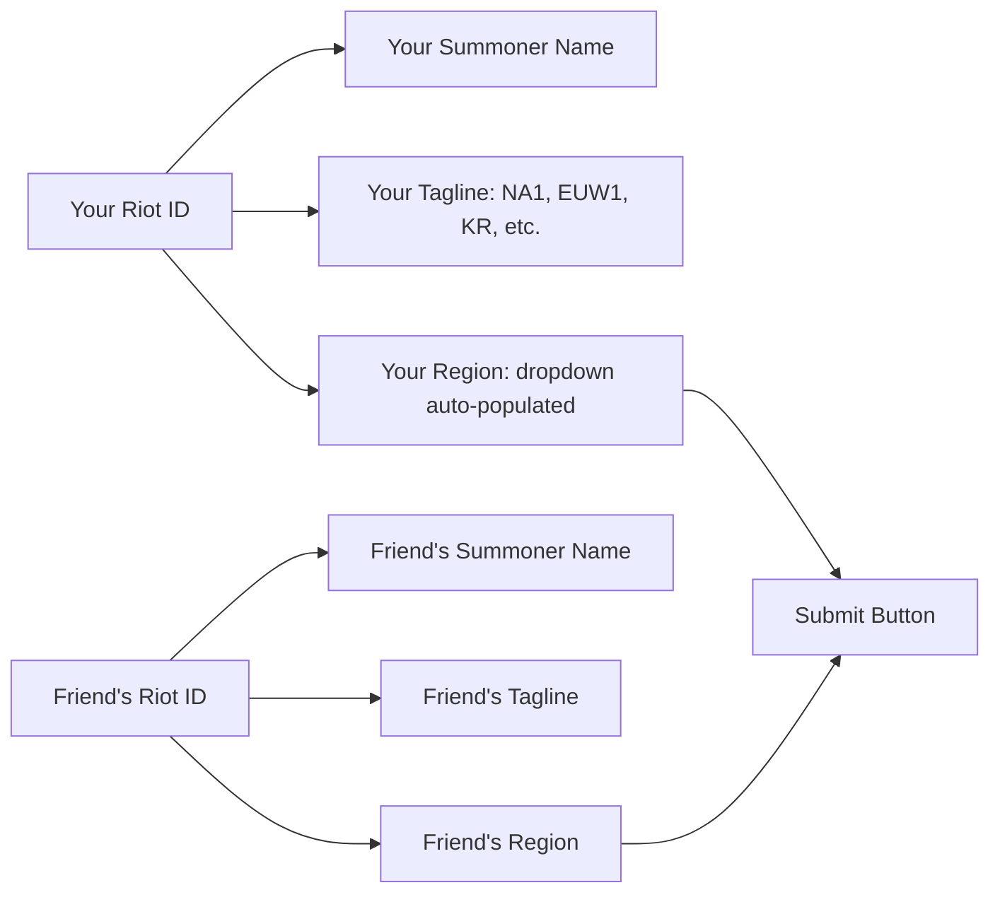

# Wireframes — User Workflow

## Flow 1: Find Shared Games (Mermaid)

## Flow 2: Input Fields (Mermaid)

## Key Decisions

1. **Input:** Two Riot IDs (username#tagline) + region dropdown (auto-populated)
   - Why: Riot API requires full Riot ID for account lookup
   - Tagline = server identifier (e.g., "NA1", "EUW1", "KR")
   - Region dropdown auto-populates from tagline (can be manually overridden)

2. **Supported Regions:** All Riot servers (not just the 3 select in current frontend)
   - Current: NA1, EUW1, KR (hardcoded in index.html)
   - Need: Add BR1, LA1, LA2, OC1, TR1, RU, SG, PH, TH, TW, JP, VN
   - Auto-population from tagline simplifies UX

3. **Output Layout:** Shared games table with pagination
   - Columns: Date, Game Mode, Queue, Result, Champion A, Champion B, Link
   - Link to op.gg/u.gg for full match details

## Wireframe Notes

- **Minimalist UI** — just the form, loading state, and results
- **No extra fluff** — user shouldn't need to know about API limits
- **Error handling** — clear messages for missing fields, no shared games, etc.
- **Future expansion** — could add "My Matches" history later
- **Tagline is REQUIRED** — not optional. This was a key finding from API research

## Files

- `wireframes.md` — this document
- `frontend/index.html` — form UI (currently 3 region select)
- `frontend/app.js` — form handler (currently demo mode)
- `config.js` — region enum (currently 3 values, needs expansion)
