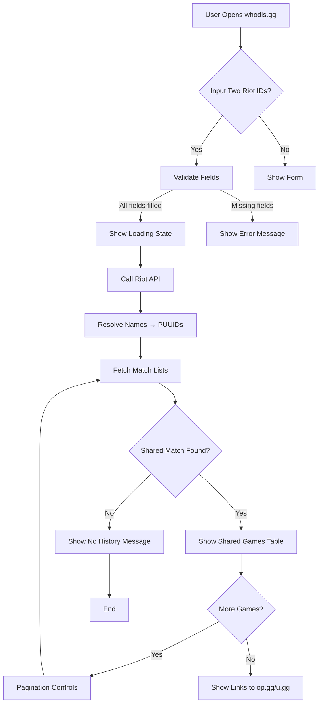

# Wireframes — User Workflow

## Flow 1: Find Shared Games (Mermaid)



## Flow 2: Input Fields (Mermaid)

```mermaid
flowchart LR
    A[Your Riot ID] --> B[Your Summoner Name]
    A --> C[Your Tagline (server ID, e.g., NA1, EUW1, KR, EUN1)]
    A --> D[Your Region: dropdown for API routing]
    E[Friend's Riot ID] --> F[Friend's Summoner Name]
    E --> G[Friend's Tagline]
    E --> H[Friend's Region]
    D --> I[Submit Button]
    H --> I
```

## Key Decisions

1. **Input:** Two Riot IDs (username#tagline) + region dropdown (for API routing)
   - Why: Riot API requires full Riot ID for account lookup
   - Tagline = server identifier (e.g., "NA1", "EUW1", "KR", "EUN1") — used for `/riot/account/v1/accounts/by-riot-id`
   - Region dropdown = API routing region (americas/europe/asia/sea) — used for `/lol/match/v5/matches/by-puuid`
   - Region is NOT auto-populated from tagline; user selects the correct routing region

2. **Supported Regions (Platform Codes):** All Riot servers
   - NA1, BR1, LA1, LA2, OC1 → americas
   - EUW1, EUN1, TR1, RU → europe
   - KR, JP1 → asia
   - SG2, PH2, TH2, TW2, VN2 → sea

3. **Output Layout:** Shared games table with pagination
   - Columns: Date, Game Mode, Queue, Result, Champion A, Champion B, Link
   - Link to op.gg/u.gg for full match details

## Wireframe Notes

- **Minimalist UI** — just the form, loading state, and results
- **No extra fluff** — user shouldn't need to know about API limits
- **Error handling** — clear messages for missing fields, no shared games, etc.
- **Future expansion** — could add "My Matches" history later
- **Tagline is REQUIRED** — not optional. This was a key finding from API research

## Files

- `docs/009-wireframes.md` — this document
- `frontend/index.html` — form UI
- `frontend/app.js` — form handler
- `frontend/config.js` — region enum