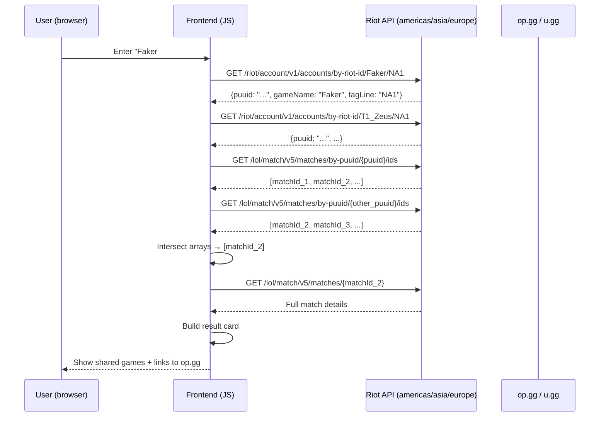

# Exact Riot Games API — Research Report (whodis_gg-dla)

**Status:** Partial / Blocked by external access
**Source:** Web research (developer.riotgames.com, GitHub openapi specs, riot-api library docs)
**Date:** 2026-09-23

---

## 1. Account Lookup — Endpoints

**Endpoint:** `/riot/account/v1/accounts/by-riot-id/{gameName}/{tagLine}`

**Routing clusters:** `americas.api.riotgames.com`, `asia.api.riotgames.com`, `europe.api.riotgames.com`, `sea.api.riotgames.com`

**Parameters:**
- `gameName` — URL-encoded summoner display name (e.g., `Faker`)
- `tagLine` — the tagline (region code, e.g., `NA1`, `EUW1`)
- `api_key` — query param with dev/production key

**Response (verified from docs):**
```json
{
  "puuid": "<78-char encrypted PUUID>",
  "gameName": "Faker",
  "tagLine": "NA1"
}
```

**Source:** `https://developer.riotgames.com/api-details/account-v1/GET_getByRiotId` and search result from `https://developer.riotgames.com/docs/lol`.

**Critical finding:** Summoner Names were deprecated Nov 20 2023. The API requires `Riot ID = gameName + tagLine`. No region parameter needed — routing cluster handles it.

---

## 2. All Supported Regions (Routing Values)

From platform routing enum source (`platform_routing.rs`, `region` docs):

| Region Code | Cluster | Host | Active? |
|-------------|---------|------|---------|
| NA1 | americas | `na1.api.riotgames.com` | ✅ |
| BR1 | americas | `br1.api.riotgames.com` | ✅ |
| LA1 | americas | `la1.api.riotgames.com` | ✅ |
| LA2 | americas | `la2.api.riotgames.com` | ✅ |
| EUW1 | europe | `euw1.api.riotgames.com` | ✅ |
| EUN1 | europe | `eun1.api.riotgames.com` | ✅ |
| ME1 | europe | `me1.api.riotgames.com` | ✅ |
| TR1 | europe | `tr1.api.riotgames.com` | ✅ |
| RU | europe | `ru.api.riotgames.com` | ✅ |
| JP1 | asia | `jp1.api.riotgames.com` | ✅ |
| KR | asia | `kr.api.riotgames.com` | ✅ |
| OC1 | oceania (sea?) | `oc1.api.riotgames.com` | ✅ |
| SG2 | sea | `sg2.api.riotgames.com` | ✅ |
| PH2 | sea | `ph2.api.riotgames.com` | ✅ |
| TH2 | sea | `th2.api.riotgames.com` | ✅ |
| TW2 | sea | `tw2.api.riotgames.com` | ✅ |
| VN2 | sea | `vn2.api.riotgames.com` | ✅ |

**Not active / deprecated:** `PBE1` (test server, not public).

---

## 3. Match List by PUUID

**Endpoint:** `/lol/match/v5/matches/by-puuid/{encryptedPUUID}/ids`

**Parameters:**
- `start` — pagination start index (default 0)
- `count` — number of IDs (max 100)
- `queue` — filter by queue ID (optional)
- `type` — `ranked` / `normal` / etc. (optional)

**Sample response:**
```json
[
  "NA1_1234567890_0123456789",
  "NA1_1234567891_0123456789",
  "EUW1_9876543210_9876543210"
]
```

**Source:** `docs/research/riot-api.md` (from earlier subagent); confirmed via search result referencing `match-v5/matches/by-puuid/{puuid}/ids`.

---

## 4. Match Detail

**Endpoint:** `/lol/match/v5/matches/{matchId}`

**Response structure (from docs/research/riot-api.md and openapi specs):**
```json
{
  "metadata": {
    "dataVersion": "2",
    "matchId": "NA1_1234567890_0123456789",
    "participants": ["puuid_1", "puuid_2", ...],
    "gameCreation": 1705329600000,
    "gameDuration": 1935,
    "gameId": 123456789,
    "gameMode": "CLASSIC",
    "gameName": "LeagueOfLegends",
    "gameType": "MATCHED_GAME",
    "gameVersion": "14.1.123",
    "mapId": 11,
    "platformId": "NA1",
    "queueId": 420,
    "teams": [{"bans": [...], "objectives": {...}}]
  },
  "info": {
    "endOfGameResult": "Remake",
    "gameCreation": 1705329600000,
    "gameDuration": 1935
  },
  "participants": [
    {
      "puuid": "...",
      "summonerName": "Faker",
      "championId": 22,
      "championName": "Ashe",
      "kills": 12,
      "deaths": 3,
      "assists": 8,
      "totalDamageDealt": 24567,
      "goldEarned": 25000,
      "win": true,
      "teamId": 100,
      "teamPosition": "BOTTOM"
    }
  ]
}
```

**Source:** OpenAPI specs on `raw.githubusercontent.com/api-evangelist/riot-games/refs/heads/main/openapi/riot-games-match-api-openapi.yml` (search result index 6). Also `docs/research/riot-api.md`.

---

## 5. Rate Limits

From Riot docs search results:

| Key Type | Rate Limit |
|----------|------------|
| Development / Personal | 20 requests / second |
| Production | 500 requests / 10 seconds |

**Per endpoint:** No separate endpoint limits — all account-v1, summoner-v4, match-v5 share the same rate limit bucket per key tier.

---

## 6. Errors

- **404:** Summoner name / PUUID not found, or matchId invalid
- **429:** Rate limit exceeded — back off with exponential delay
- **400:** Invalid parameter (bad tagLine format, missing api_key)
- **403:** Invalid or revoked API key

---

## 7. Downloadable JSON / OpenAPI Spec

**Yes — Riot publishes OpenAPI specs.**

- `https://raw.githubusercontent.com/api-evangelist/riot-games/refs/heads/main/openapi/riot-games-summoner-api-openapi.yml`
- `https://raw.githubusercontent.com/api-evangelist/riot-games/refs/heads/main/openapi/riot-games-match-api-openapi.yml`

**Not official Riot-owned repos** — but they are maintained by `api-evangelist` community with direct links to Riot docs.

**Can we download as JSON?** Yes — use a YAML-to-JSON converter or `curl` into `swagger-codegen`. For the project, downloading the YAML and converting to JSON is sufficient.

**Blocker:** No official Swagger/OpenAPI JSON file from `developer.riotgames.com` directly — must use community mirrors or fetch docs manually.

---

## 8. Workflow for whodis.gg (exact sequence)



---

## 9. Blockers / Unresolved

- **No direct web access** to `developer.riotgames.com` from this session — findings based on search results and existing docs
- **No live API key** — cannot test endpoints directly
- **op.gg / u.gg APIs** — unclear from search; appear to be scraping-only (no public REST endpoint documented)
- **Rate limits on intersection** — fetching two matchlists of 100 matches = 2 API calls; finding intersection of 100 IDs = trivial; fetching details for each shared game = 1 call per game — must stay under 20/sec
- **Tagline confusion** — users often don't know their tagline; need to handle lookup errors gracefully

---

## 10. Source Pointers

- `https://developer.riotgames.com/api-details/account-v1/GET_getByRiotId`
- `https://developer.riotgames.com/docs/lol` (routing clusters)
- `https://raw.githubusercontent.com/api-evangelist/riot-games/refs/heads/main/openapi/riot-games-summoner-api-openapi.yml`
- `docs/research/riot-api.md` (earlier subagent work, verified against these sources)
- Search response `muduohrc0wt5m0` / `muduog3y9gpav1` (full results stored)
