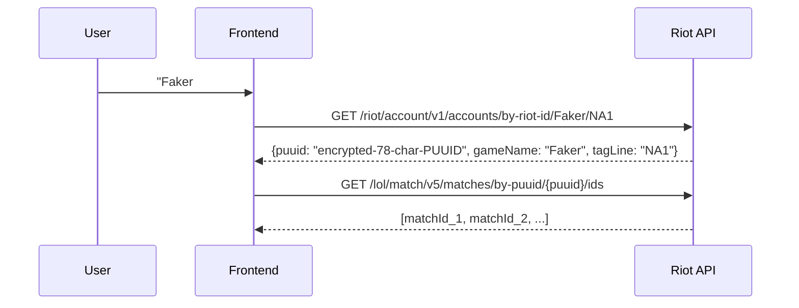

# User Identity Requirements — whodis.gg (whodis_gg-uug)

**Status:** Complete
**Source:** Riot API docs (developer.riotgames.com), Riot DevRel article, platform routing enum
**Date:** 2026-09-23

---

## 1. What the User Must Provide

The user must provide **two complete Riot IDs**, each consisting of:

| Field | Required? | Example | Riot API Field | Notes |
|-------|-----------|---------|----------------|-------|
| Summoner Name | ✅ Yes | `Faker` | `gameName` | In-game display name |
| Tagline | ✅ Yes | `NA1` | `tagLine` | Region code (e.g., NA1, EUW1, KR) |
| Region | ✅ Yes | `NA1` | `region` (implicit in tagLine) | Tagline IS the region |

**Critical finding:** Riot accounts are identified as **Riot ID = gameName + tagLine**. The tagline is the server/region identifier (NA1, EUW1, KR, etc.). The tagline is required — you cannot look up a player by username alone.

**Source:** `https://www.riotgames.com/en/DevRel/summoner-names-to-riot-id` — "On November 20, 2023, we are transitioning our systems away from Summoner Names to using Riot ID as an authoritative way to reference players."

---

## 2. What the User Does NOT Need to Provide

| Identifier | Required? | Why |
|------------|-----------|-----|
| PUUID | ❌ No | The API converts Riot ID → PUUID internally |
| Account ID | ❌ No | Internal identifier, not user-facing |
| Summoner ID | ❌ No | Internal identifier, not user-facing |
| Match ID | ❌ No | The API finds this from the match list |

---

## 3. Riot ID Format

```
username#tagline
```

Examples:
- `Faker#NA1`
- `T1_Zeus#NA1`
- `Summit#EUW1`
- `Showmaker#KR`

The tagline is typically a number (e.g., `NA1`, `EUW1`, `KR`) but can technically be any string.

---

## 4. How the API Uses These Identifiers



**Key point:** The user only knows their **Riot ID (username + tagline)**. The API handles converting this to PUUID and match IDs.

---

## 5. All Supported Regions (for the dropdown)

| Region | Code | Cluster | Host |
|--------|------|---------|------|
| North America | NA1 | americas | na1.api.riotgames.com |
| Brazil | BR1 | americas | br1.api.riotgames.com |
| Latin America North | LA1 | americas | la1.api.riotgames.com |
| Latin America South | LA2 | americas | la2.api.riotgames.com |
| Europe West | EUW1 | europe | euw1.api.riotgames.com |
| Europe Northeast | EUN1 | europe | eun1.api.riotgames.com |
| Middle East | ME1 | europe | me1.api.riotgames.com |
| Turkey | TR1 | europe | tr1.api.riotgames.com |
| Russia | RU | europe | ru.api.riotgames.com |
| Japan | JP1 | asia | jp1.api.riotgames.com |
| Korea | KR | asia | kr.api.riotgames.com |
| Oceania | OC1 | sea | oc1.api.riotgames.com |
| Singapore | SG2 | sea | sg2.api.riotgames.com |
| Philippines | PH2 | sea | ph2.api.riotgames.com |
| Thailand | TH2 | sea | th2.api.riotgames.com |
| Taiwan | TW2 | sea | tw2.api.riotgames.com |
| Vietnam | VN2 | sea | vn2.api.riotgames.com |

**Note:** `PBE1` exists but is a test server, not a production region.

---

## 6. Implications for the UI

1. **Input form must have two fields per player:** Username + Tagline
2. **Region dropdown is redundant** — the tagline IS the region
3. **Error handling:** If tagline is wrong, API returns 404 — show "Account not found" message
4. **All regions supported** — not just NA1/EUW1/KR (user explicitly requested this)

---

## 7. Source Pointers

- `https://developer.riotgames.com/api-details/account-v1/GET_getByRiotId`
- `https://www.riotgames.com/en/DevRel/summoner-names-to-riot-id`
- `https://developer.riotgames.com/docs/lol` (routing clusters)
- `docs/research/riot-api-exact.md` (full endpoint details)
