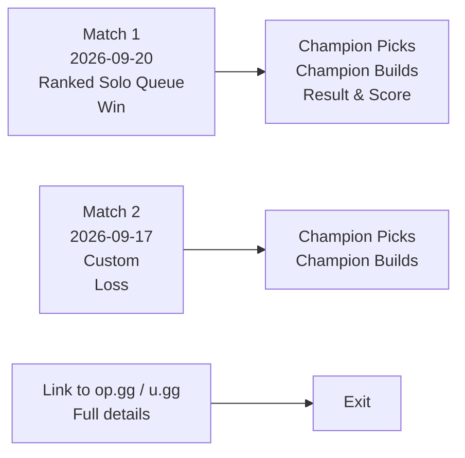

# Wireframes — User Workflow (whodis.gg)

## Scope: Bounded to user workflow wireframes only.
No backend, no API, no design decisions beyond layout.

---

## 1. Input Form (Step 1)

```
+--------------------------------------------------+
|  FIND SHARED GAMES                               |
+--------------------------------------------------+

 [Your Summoner Name]    [Your Region ▶]          
                                     (NA1, EUW1, KR, BR1, ...)

 [Friend Request Sender]  [Their Region ▶]

 [Find Shared Games]  ← submit

 Status: "Enter both Riot IDs to begin"
```

**Fields required (confirmed from Riot API research):**
- Player A: `summonerName` (username) + `tagLine` (tagline, e.g. NA1) + region
- Player B: `summonerName` + `tagLine` + region

**Key insight:** The tagline IS part of the Riot ID, not just region. The form needs 3 fields per player.

---

## 2. Loading State (Step 2)

```
+--------------------------------------------------+
|  SEARCHING...                                     |
|  Resolving Riot IDs → Fetching match lists →      |
|  Finding overlaps...                              |
|                                                  |
|  [spinner]                                       |
+--------------------------------------------------+
```

---

## 3. Results — Shared Games Found (Step 3a)



**Table view (text wireframe):**

| Date | Queue | Result | Your Champ | Their Champ | Link |
|---|---|---|---|---|---|
| 2026-09-20 | Ranked Solo | Win | Jinx | Yasuo | [op.gg] [u.gg] |
| 2026-09-17 | Custom | Loss | Lux | Jinx | [op.gg] [u.gg] |

---

## 4. Results — No Shared Games (Step 3b)

```
+--------------------------------------------------+
|  NO SHARED GAMES FOUND                          |
+--------------------------------------------------+

 These players have no overlapping match history.

 Suggest: Check if the friend-request sender is a bot,
 random person, or if you played them in a different region.

 [Try different region] [Back to search]
```

---

## 5. Match Detail View (Step 4 — Link Out)

No wireframe needed — this is handled by linking to op.gg/u.gg.

Link format (from research):
- op.gg: `https://op.gg/lol/summoners/{region}/{name}-{tagline}`
- u.gg: `https://u.gg/lol/profile/{region}/{name}-{tagline}/overview`
- Match detail: `https://op.gg/lol/matches/{region}/{matchId}`

---

## Key Design Decisions (Wireframe Only)

1. **Two-player comparison, not single-player profile** — the tool's unique value is comparing two players, not showing one player's stats.
2. **No database** — results come directly from Riot API; nothing to store.
3. **All regions supported** — the form must allow selecting any Riot server region.
4. **Clear "no results" state** — important for the user's use case (distinguishing bot from real friend).
5. **Link out for details** — full builds/runes/items are shown by linking to op.gg/u.gg, not rebuilt here.

---

## Source References

- File: `docs/user-requirements.md` — input requirements updated with tagline
- File: `docs/research/riot-api-exact.md` — endpoint details for PUUID resolution
- File: `frontend/index.html` — existing form UI (needs tagline field added)
- File: `frontend/config.js` — region mapping (currently 3 regions, needs all)
